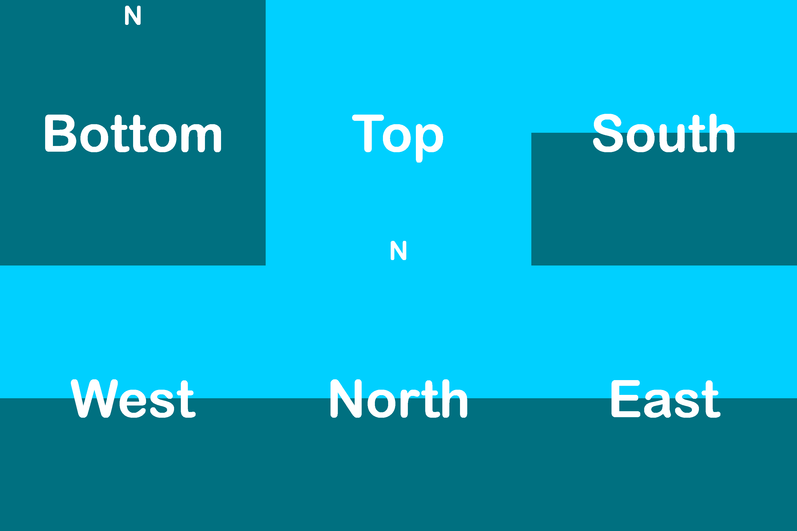

# Welcome to the Skyboxify wiki!

On this page, you will find a comprehensive guide for creating a custom sky for your resource pack.

Throughout the document you will find examples, and the bottom of the page, you will find examples for complete configuration files, and a template resource pack.

In the configuration files, there are 12 types of parameters you can use to adjust the behavior of your sky.

Each configuration file is one "layer" of the sky. These "properties" files are named sequentially, such as sky1.properties, sky2.properties, etc.., where sky1.properties is rendered first, and each subsequent layer is rendered on top of the previous one.

To begin writing your properties file, create a text file, and save it with a .properties extention.

## 0. Dimensions
Before starting, it is important to know that dimensions are controlled by which folder the properties files are placed inside.
Vanilla dimensions:
* The Overworld: `world0`
* The Nether: `world-1`
* The End: `world1`

## 1. Source
Defines the source texture used for rendering the sky. This object is required.

`source=minecraft:optifine/sky/world0/sky1.png`

Example for a sky texture:



## 2. Blend
Defines how the texture should blend with the previous sky layer, the first layer always being the vanilla sky. This object is optional.
Default blend mode is `add`.
Supported blend modes are: `alpha`, `screen`, `dodge`, `add`, `multiply`, `burn`, `overlay`, `subtract` and `replace`.

`blend=alpha`

## 3. Fade
Defines when the sky should be rendered throughout the day. These objects are optional.
This object uses the hh:mm format to define the in-game time.

`startFadeIn`: Defines when the sky should start fading in. At this exact specified time, the opacity of the sky will be 0%.\
`endFadeIn`: Defines when the sky should end fading in. At this exact specified time, the opacity of the sky will be 100%.\
`startFadeOut`: Defines when the sky should start fading out. At this exact specified time, the opacity of the sky will be 100%. This object is extra optional, and when not specified, the sky will start fading out immediately after the `endFadeIn` time.\
`endFadeOut`: Defines when the sky should end fading out. At this exact specified time, the opacity of the sky will be 0%.

```
startFadeIn=19:18
endFadeIn=20:18
startFadeOut=3:42
endFadeOut=4:42
```
conversion table:
| Time in Ticks | Clock Time |
|---------------|------------|
| 0 | 6 AM |
| 6000 | 12 AM |
| 12000 | 6 PM |
| 18000 | 12 PM |

## 5. Axis
Specifies a list of three floating-point literals to represent the axis of rotation as a vector. This object is optional.
When looking in the direction of this vector, the sky will appear to be rotating clockwise.
The default value is `0.0 0.0 1.0`. This vector is pointing to the south.
These values must be separated by a space.

`axis=0.0 -1.0 0.0`

This vector must have a length of 1 unit, otherwise you will get strange results. The example below is not a valid configuration, as this vector only has a length of 0.2 units.

`axis=0.0 -0.2 0.0`

To generate different axis values, a Blender tool has been developed courtesy of @UsernameGeri, allowing real-time visualization and adjustment to this value, providing insights into its impact on the skybox's rotation. This tool is compatible with both OptiFine/Skyboxify as well as Nuit.

Instructions for the tool are documented within the blend file. Only the most basic Blender skills are required to utilize this tool, such as navigating the interface and selecting- and rotating objects.

[skybox rotation.blend](https://github.com/UsernameGeri/Skyboxify/raw/refs/heads/docs/docs/skybox%20rotation.blend) 

Blender is a free, open source software. Download at https://www.blender.org/

## 6. Speed
Defines how many rotations should the sky make per an in-game day. This object is optional.
Default value is `1`.

`speed=0.1234`

## 7. Days Loop
Defines a range of days to loop. This object is optional.
This range goes from 0 to daysLoop-1, so a loop of 10 days will range from 0 to 9.
Default value is `8`.

`daysLoop=15`

## 8. Days
Defines which days the sky should be rendered on inside the `daysLoop`. This object is optional.
Within this object, multiple days, as well as whole ranges can be specified.
These values can be separated by a space or a comma `,`.

`days=0 1 2 6-10 14`\
`days=0,1,2,6-10,14`

## 9. Weather
Defines during which type of weather should the sky be rendered. This object is optional.
Default value is `clear`.
Valid entries are: `clear`, `rain`, `thunder`.
These entries must be separated by a space.

`weather=clear rain`

## 10. Biomes
Defines in which biomes should the sky be rendered in. This object is optional.
When not specified, the sky will be rendered in all biomes.
These entries must be separated by a space.

`biomes=plains forest river`

In addition, an exclamation mark `!` can be used to invert the biome selection, meaning that the sky will *not* be rendered in the specified list, but will be everywhere else.

`biomes=!plains forest river`

## 11. Heights
Defines at which Y level(s) should the sky be rendered in. This object is optional.
When not specified, the sky will be rendered at all Y levels.
Within this object, multiple Y levels, as well as whole ranges can be specified.
These values can be separated by a space or a comma `,`.

`heights=70 72 100-115`\
`heights=70,72,100-115`

Ranges can be specified as lowest-to-highest, or highest-to-lowest, such as:\
`heights=100-115`\
or\
`heights=115-100`

_The following configurations currently do not work, these are currently discrepancies with Optifine's format._
***
When using negative hight values in a range, the second value must be in brackets: `heights=-20-(-10)`

This will also work: `heights=(-20)-(-10)`

However this will not work: `heights=-20--10`

Positive values can also be placed in brackets: `heights=(100)-(115)`
***

## 12. Transition
Defines how many seconds should it take for the sky to fade in when certain conditions are met. This object is optional.
Default value is `1`.
This object only effects `biomes` and `heights`.

`transition=10`

## Examples and template pack
_todo_
